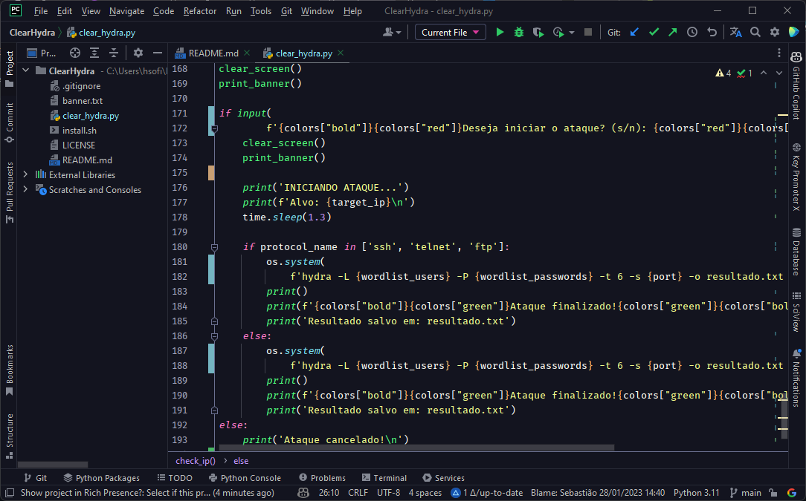

<h1 align="center">
   
  
   
   
  Obscure Theme for <a href="https://www.jetbrains.com/products/">JetBrains Platform IDEs</a>
   
</h1>

  <strong>Dark Theme for IDEs</strong>

  

 

  

 

  <strong>Contributions are welcome</strong> on <a href="https://github.com/henriquesebastiao/ObscureTheme">GitHub</a>

<h6 align="center">Developed by <em>Henrique Sebastião</em></h6>